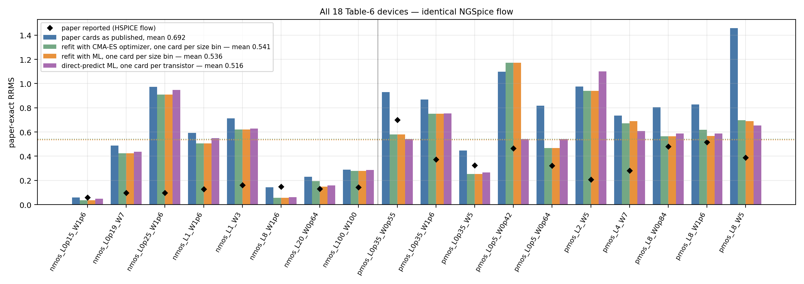
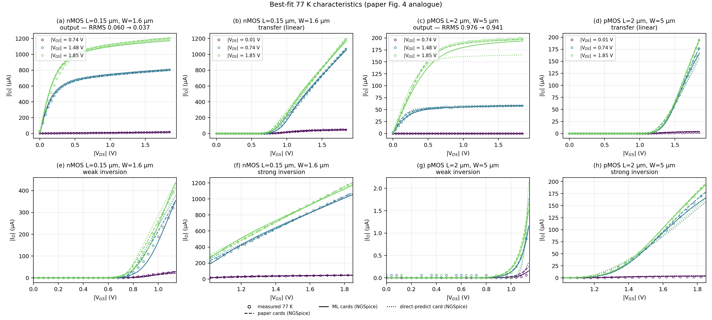
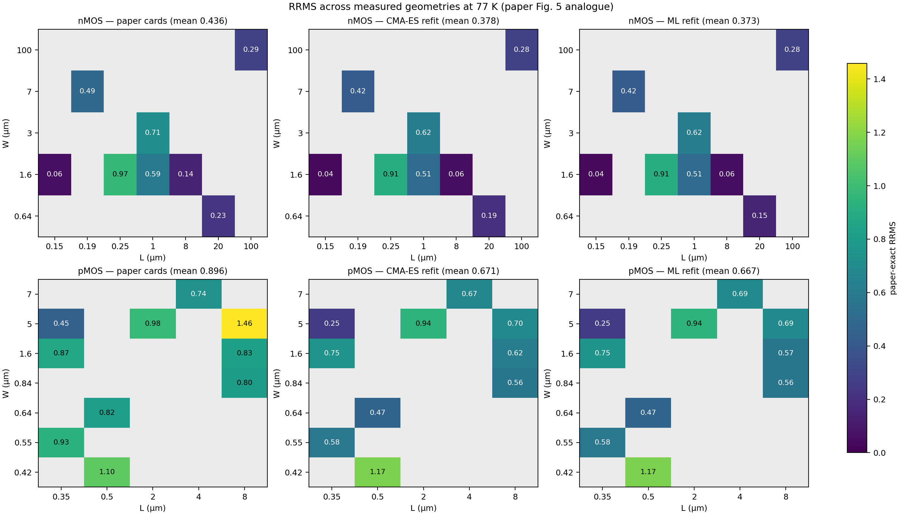
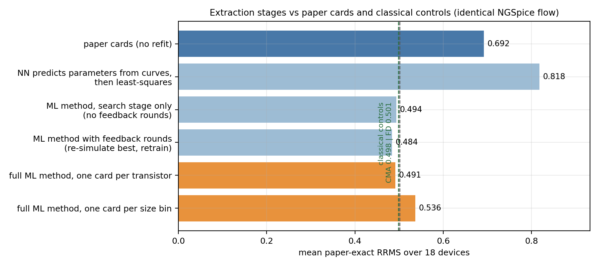

# cryo-bsim4-ml

ML-guided extraction of cryogenic (77 K) SKY130 BSIM4 parameter cards that
**beats both the published cards of arXiv:2604.21625 and the paper's
extraction method re-run with classical optimizers, in an identical
open-source NGSpice flow**, over all 18 Table-6 devices:

| method (identical NGSpice chain, paper-exact RRMS) | per-device | deployable¹ |
|---|---:|---:|
| paper cards (no fitting) | 0.692 | 0.692 |
| FD control — multistart least squares (paper-method retry) | 0.501 | 0.550 |
| CMA-ES control — 8,500 evals/device, budget-matched to ML | 0.498 | 0.541 |
| **ML (one-shot surrogate v2 + active-BO ensemble v3)** | **0.491** | **0.536** |
| paper reported (proprietary HSPICE/Mystic flow) | 0.279² | — |

¹ deployable = one card per model bin (what a real library ships); all
methods subjected to the same joint-fit constraint.
² not comparable: nothing run through NGSpice reaches it on this data — see
"Why the paper's numbers can't be compared directly".

By device family (per-device / deployable): nMOS — best classical
0.378 / 0.378, ML **0.373 / 0.373**; pMOS — best classical 0.594 / 0.671,
ML **0.586 / 0.667**. ML leads both families in both regimes; the entire
deployment cost falls on pMOS, where both shared model bins live
(per-family columns in `out/tables/comparison.md`).

Evidence the comparison is meaningful: tripling the classical budget
(2,400 → 8,500 NGSpice evals/device) improves CMA-ES by only 0.001 — the
classical methods have plateaued. The standalone ML pipelines score 0.494
(one-shot surrogate) and 0.493 (active-BO ensemble) without any warm
starts; with the classical winners folded in as candidates the final ML
result never loses a device to any control (18/18 wins or ties). Scaling
behavior (training-set size, emulator capacity, search budget) is
characterized in `figs/scaling_laws.png`.

```text
tuned parameters: VTH0, U0, NFACTOR, VSAT, DELTA, RDSW, ETA0
```



## Why the paper's numbers can't be compared directly

The paper reports mean RRMS `0.279` from its HSPICE/Mystic flow. Running the
paper's *own published cards* through NGSpice yields `0.692`. The gap is real
and reproducible, so the only fair comparison is **method vs method inside
the identical NGSpice chain**. Contributing causes we isolated:

- **Simulator gap.** Specific devices (e.g. pMOS 0.35/1.6, nMOS 20/0.64,
  nMOS 100/100) simulate ~2x worse in NGSpice than reported even with the
  most favorable bin choice — a genuine HSPICE-vs-NGSpice model evaluation
  difference, not a deck bug. Not an NGSpice-version artifact either: running
  the published cards through the corrected repo's *exact* pinned
  `ngspice=41` gives 0.743 (worse than ngspice-46's 0.692, still ~2.5x the
  paper); on 13/18 devices the two NGSpice versions are byte-identical and
  the rest differ only by overlapping-pMOS bin tie-breaking
  (`scripts/compare_ng_versions.py`).
- **Scale-units trap.** The cryo corner files set `.option scale=1.0u`, so
  instances must pass bare micron numbers (`l=0.15 w=1.6`). Passing `l=0.15u`
  silently misses every bin box and NGSpice reports "could not find a valid
  modelname" — the long-standing "NGSpice can't bin" blocker.
- **Overlapping pMOS bins.** The published pMOS card has 12 bins for 10
  devices with overlapping L/W boxes, so native bin selection can map a
  device to a bin that was fit to a different device.
- **Measured-data limits.** Some device-off sweeps contain instrument spikes
  and ~6 µA range-quantization that no simulator can fit; several devices
  show real high-Vd leakage floors whose BSIM4 knobs (GIDL) are outside the
  7 tuned parameters. These bound every method identically (diagnostics in
  `docs/RESEARCH_LOG.md`).

## Fairness rules

- Published 77 K corner files + Volare SKY130 PDK revision
  `a918dc7c8e474a99b68c85eb3546b4ed91fe9e7b`, corrected-repository deck
  convention (`ogzamour/CryoSkywater130nm_CorrectedForNgspice`).
- Native geometry-bin selection — NGSpice picks the bin; never chosen from
  measured scores.
- Only the paper's seven parameters are tuned, same bounded parameter box
  for every method.
- Optimization, selection, and reporting all use the paper companion
  notebook's all-curve RRMS, corrupted curves included, for every method.
- Every reported number comes from a real NGSpice run; classical controls
  get a comparable simulation budget.
- Deployable comparisons apply the same one-card-per-bin joint constraint
  to every method.

## Pipeline

1. `scripts/verify_simulator.py` — verify the harness against the corrected
   repository's saved NGSpice sweeps.
2. `scripts/pdk_baseline.py` — run the published cards (the no-fit baseline).
3. `scripts/pdk_fd_extract.py` / `scripts/pdk_cma_extract.py` — classical
   controls: the paper-method retry (multistart FD least squares) and
   CMA-ES + polish.
4. `scripts/pdk_gen_data.py --centers-from out/pdk_fd` — 6,000 NGSpice
   samples per device in the native bin (quarter concentrated around the
   FD winner's basin).
5. `scripts/pdk_ml_extract.py` (v2) — per device: train a neural emulator
   (parameters → curves, 512×4 MLP) and an inverse MLP (curves →
   parameters); 2,048-start gradient search through the frozen emulator;
   validate candidates in real NGSpice (controls' winners compete as warm
   starts); finite-difference polish; joint emulator search + polish for
   devices sharing a model bin.
6. `scripts/pdk_ml_active.py` (v3) — ensemble active-BO: 3 emulators,
   pessimistic mean+std acquisition (half the starts explore disagreement),
   4 rounds of search → NGSpice-validate → append true evaluations →
   fine-tune the ensemble.
7. `scripts/make_fd_deploy.py` — deployable (shared-bin) variants of the
   classical controls.
8. `scripts/pdk_compare.py` — recompute and report paper-exact RRMS for
   every method.
9. `scripts/export_ml_cards.py --src out/pdk_ml_final` — export one
   combined nMOS/pMOS 77 K library
   (`out/pdk_ml_final/cards/sky130_77k_ml.lib.spice`).
10. `scripts/scaling_study.py` / `scripts/make_scaling_fig.py` — scaling
    laws for data / capacity / search.
11. `scripts/make_figs.py` — regenerate all figures. (`scripts/make_slides.py`
    can rebuild the summary deck locally; the deck itself is not shipped.)

## Results

Per-device numbers for all methods: [`out/tables/comparison.md`](out/tables/comparison.md);
Table-6 analogue with RMSE and σ: [`out/tables/table6.md`](out/tables/table6.md);
experiment history and diagnostics: [`docs/RESEARCH_LOG.md`](docs/RESEARCH_LOG.md).

Figures mirror the paper's:

| paper figure | this repo |
|---|---|
| Fig. 2 — representative I-V at 77 K | `figs/fig2_iv_77k.png` |
| Fig. 4 — best-fit characteristics | `figs/fig4_bestfit.png` |
| Fig. 5 — RRMS heat maps across geometries | `figs/fig5_rrms_heatmap.png` |
| Table 6 — per-device error metrics | `figs/table6_bars.png`, `out/tables/table6.md` |
| (extra) extraction-stage ablation | `figs/ml_ablation.png` |
| (extra) every device, all curves | `figs/devices/<tag>.png` |





The ablation shows where the ML gain comes from: the surrogate-only search
already approaches the classical controls, NGSpice polish pushes past them,
and the shared-bin constraint (applied to every method) costs everyone
about the same:



## Setup

```bash
python -m venv .venv
source .venv/bin/activate
pip install -r requirements.txt
python scripts/setup_data.py
```

Install NGSpice separately; the validated environment uses `ngspice-46`.

## Run

```bash
python scripts/pdk_baseline.py
python scripts/verify_simulator.py
python scripts/pdk_fd_extract.py --workers 8
python scripts/pdk_cma_extract.py --workers 8 --evals 8500
python scripts/pdk_gen_data.py --num-samples 6000 --workers 10 --centers-from out/pdk_fd
python scripts/pdk_ml_extract.py --device mps \
  --emu-arch 512,512,512,512 --inv-arch 1024,512 \
  --n-adam-starts 2048 --adam-steps 600 --n-validate 14 --n-polish 5 \
  --max-nfev 120 --starts-from out/pdk_fd,out/pdk_cma --out-dir out/pdk_ml2
python scripts/pdk_gen_data.py --num-samples 2000 --workers 10 --append \
  --centers-from out/pdk_ml2_perdev
python scripts/pdk_ml_active.py --device mps \
  --starts-from out/pdk_fd,out/pdk_cma,out/pdk_ml2_perdev --out-dir out/pdk_ml3
python scripts/make_fd_deploy.py
python scripts/make_fd_deploy.py --src out/pdk_cma --dst out/pdk_cma_deploy
python scripts/pdk_compare.py --methods out/pdk_fd:fd out/pdk_cma:cma_8500 \
  out/pdk_ml_final_perdev:ml_perdev out/pdk_fd_deploy:fd_deploy \
  out/pdk_cma_deploy:cma_deploy out/pdk_ml_final:ml_deploy
python scripts/export_ml_cards.py --src out/pdk_ml_final
python scripts/scaling_study.py --device mps && python scripts/make_scaling_fig.py
python scripts/make_figs.py
```

All outputs land under `out/`; figures under `figs/`. Methods details are in
[`docs/METHODS.md`](docs/METHODS.md).
